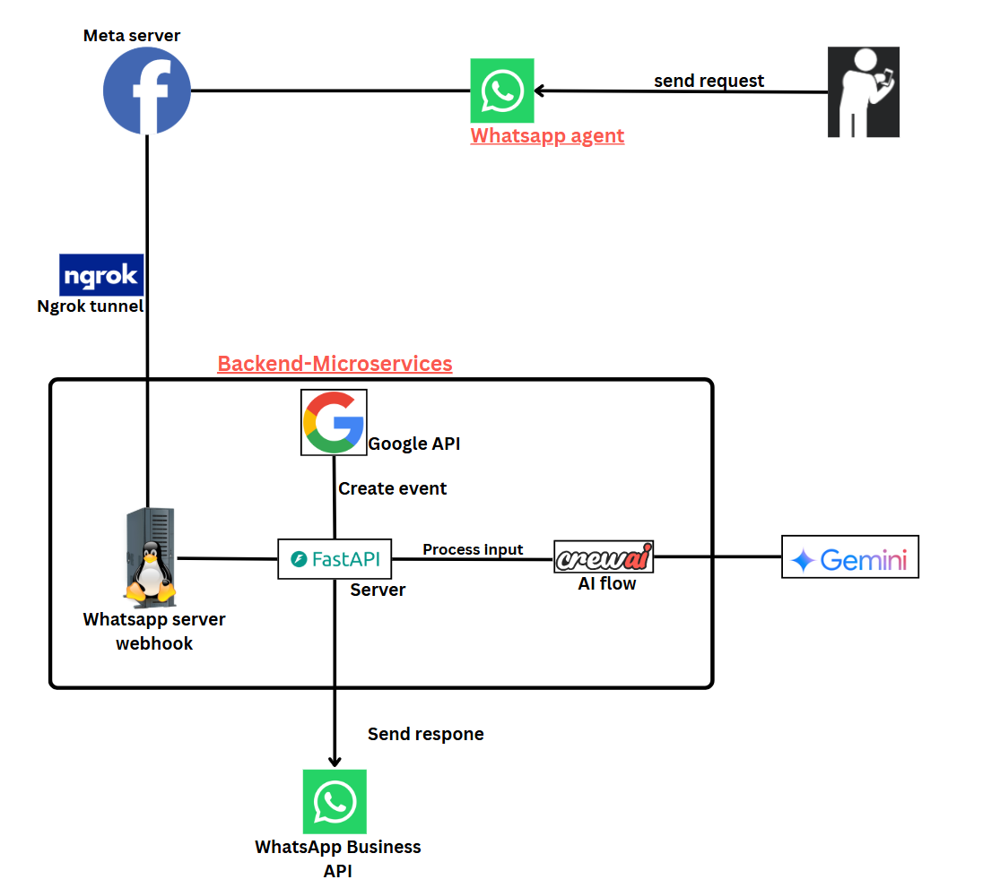

# 🤖 R2R Calendar - AI-Powered Calendar Assistant

[](https://www.python.org/downloads/)
[](https://fastapi.tiangolo.com/)
[](https://crewai.com/)
[](https://opensource.org/licenses/MIT)
[](https://github.com/yourusername/R2R-Calendar)

## 📖 Developer's Journey: Building an AI-Powered Calendar Agent

> **The complete story behind this project - from conception to production**

# Building an AI-Powered Calendar Agent: A Developer's Journey

## The Problem

I wanted to experiment with building an AI agent, starting with a vision of automated code managing my calendar scheduling. But that scope was too ambitious for a first project, so I decided to start small and solve a specific pain point: Google Calendar's form for creating new events is slow and inefficient. I wanted to use an LLM to make this process faster and more natural.

## Technology Choices and Why

### CrewAI Framework
I picked CrewAI because I first saw it mentioned on Twitter and wanted to learn about AI agent orchestration. Initially, I planned to have the LLM read existing calendar data, but I quickly realized users wouldn't want to share that sensitive information. So I scoped down to focus strictly on new event scheduling.

### WhatsApp Over Telegram
I debated between WhatsApp and Telegram. While Telegram has a more polished API and I had prior experience with it, I chose WhatsApp because:
- It's the app I use daily for note-taking and communication
- It's the most popular messaging app across Europe
- I wanted to make adoption as easy as possible for potential users

## Technical Implementation

### Google Calendar Integration
I couldn't find an easy, ready-to-use solution online, so I quickly coded my own Google Calendar tool with help from Claude AI.

### Microservices Architecture
I had two main modules that I wanted to keep separate and work with in an organized manner. I learned about `pip install -e .` which allows you to install local modules in your pip environment and use them across external projects. This approach let me maintain clean separation while testing each component independently.

### CrewAI Agent Orchestration
As I continued scoping down and focusing on efficiency, I realized I could accomplish the task with just one AI role, making the multi-agent framework almost obsolete. However, I continued building with CrewAI because I wanted to learn more about agent orchestration.

### Prompt Engineering
I focused on making the AI as accurate as possible through careful prompt design:

```python
You are .... Your sole task is ... from {user_input}, ... taking into account ... {current_date}.
```

I used arguments and context to improve accuracy, and included strict formatting rules:

```python
IMPORTANT DATE FORMAT INSTRUCTIONS:
  • The {current_date} value is provided in European/International format (DD/MM/YYYY)
  ...
  • When processing relative dates like "tomorrow", calculate based on the European format {current_date}
```

I also defined clear output requirements:

```python
Your output MUST
  • Be a **Python list of dictionaries** (valid JSON). 
...
```

To address hallucinations, I included explicit fallback instructions:

```python
  • If the user's input does not describe any new events, output an empty list: []
```

### Development Methodology
My approach was methodical: create a small module (like the calendar integration), test it thoroughly, create the CrewAI module, test it independently, then integrate them together. I only moved to the next step after ensuring each component worked perfectly in isolation.

## Infrastructure Decisions

### Backend: FastAPI
I chose FastAPI over Flask because:
- The example code looked cleaner and clearer to me
- I needed async support to handle multiple concurrent requests without appearing slow

### Hosting: Self-Hosted vs VPS
I chose to self-host rather than use a VPS because I wanted to own the server and avoid monthly payments. In retrospect, this might have been a false economy - it didn't actually save money and added complexity.

I initially tried a Raspberry Pi but ran into ARM architecture compatibility issues, so I bought a $100 x86 PC instead.

### Security
Since I was running locally, I had to expose the server to the internet safely. I used ngrok to create a secure tunnel rather than opening ports directly.

## Making It Public: SaaS Implementation

### Frontend Registration
Once everything worked locally, I needed to make it accessible to the public. I created a simple registration UI with Claude AI and hosted it free on Vercel. I incorporated Google OAuth for easy user access and to obtain calendar manipulation tokens.

### Serverless Functions
I chose AWS Lambda over Google Cloud Functions (Google had unfixable payment issues on my end). I used AWS Lambda for the Google OAuth callback to generate and store tokens in AWS DynamoDB.

### User Flow
The complete flow works like this:
1. User sends a message on WhatsApp
2. System retrieves user tokens from database
3. AI processes the input and creates calendar events

### Landing Page
I created a landing page using Bolt.run and hosted it on Netlify.

### Custom Domain Setup
After having both a landing page and registration page, I wanted to own a domain and have them both under one unified name. I chose "r2r.site" (r2r meaning Artur) and purchased the domain. I then configured both hosted sites to work under my custom domain, giving the project a more professional appearance.

## Production Deployment

### WhatsApp Business Integration
I moved from a testing number to production by purchasing a €2.50 phone number and connecting it to Meta Business.

### Linux Deployment
On my new PC, I set up Ubuntu for a nice UI, then used SSH to download my 4 GitHub repositories, install dependencies, configure ngrok and environment variables, and deploy everything.

## Results

The system has been running untouched for 2 months, and I use it every day. The total cost is:
- Electricity for the home server
- €2.50 for the WhatsApp number
- ~€0.01 monthly for AWS services

## Key Learnings

1. **Start small**: Scoping down from a grand vision to a specific problem made the project achievable
2. **Methodical development**: Testing each component independently before integration saved debugging time
3. **User-first thinking**: Choosing WhatsApp over technically superior alternatives based on user adoption
4. **Prompt engineering matters**: Careful attention to AI instructions and output formatting prevents many issues
5. **Total cost of ownership**: Self-hosting isn't always cheaper when you factor in time and complexity

This project taught me valuable lessons about AI integration, microservices architecture, and the importance of solving real problems with appropriate technology choices.
---

> **⚠️ IMPORTANT NOTICE: This is an enhanced/showcase version of a working product. This repository demonstrates improved architecture and design patterns but may not be fully functional. It was created to showcase better code organization and modular design rather than as a production-ready system.**

## 🌟 Overview

R2R Calendar is a AI-powered calendar management system that showcases advanced architecture patterns for integrating conversational AI with calendar management. This version demonstrates how to properly structure a complex system with multiple microservices, including WhatsApp messaging, Google Calendar integration, and CrewAI-powered natural language processing.

### 🏗️ What This Version Demonstrates

- **📐 Microservices Architecture**: Properly separated concerns with dedicated modules
- **🔧 Modular Design**: Each component (WhatsApp, Calendar, CrewAI) as independent packages
- **📦 Professional Packaging**: Proper Python packaging with `setup.py` and `pyproject.toml`
- **🛠️ Development Tooling**: Comprehensive setup scripts and development environment
- **📚 Documentation**: Extensive documentation and examples for each module


### 🎯 Key Features (Design Goals)

- **🗣️ Natural Language Processing**: CrewAI-powered conversation handling
- **📱 WhatsApp Integration**: Professional WhatsApp Business API wrapper
- **📅 Google Calendar Sync**: Robust calendar management module
- **🤖 AI-Powered Assistant**: Multi-agent conversation system
- **☁️ AWS Integration**: Scalable user token management
- **🔄 Event-Driven Architecture**: Proper webhook and message handling


## 🚨 Project Status

This repository represents an **enhanced architectural version** of a working calendar assistant. Key considerations:

- ✅ **Architecture**: Demonstrates best practices for microservices design
- ✅ **Code Quality**: Shows proper Python packaging and project structure
- ✅ **Documentation**: Comprehensive documentation and setup guides
- ⚠️ **Functionality**: May require additional work to be fully operational


### Why This Version Exists

This version was created to:
1. **Showcase Better Architecture**: Demonstrate how the working product is structured
2. **Learning Resource**: Serve as an example of professional Python project organization
3. **Foundation for Future Work**: Provide a solid base for further development
4. **Portfolio Piece**: Display software engineering and architecture skills

## 🏗️ Enhanced Architecture



**Flow:**
1. FastAPI forwards webhook message to CrewAI with GeminiLLM
2. CrewAI processes and sends a json to Calendar Tool
3. FastAPI sends success response back to user via WhatsApp API

## 📁 Enhanced Project Structure

```
R2R-Calendar/
├── main-server/                  # 🖥️ Central orchestration server
│   ├── whatsappBridgedAgent/     # Core business logic
│   ├── requirements.txt          # Server dependencies
│   └── env.example              # Environment template
│
├── whatsapp-module/             # 📱 Professional WhatsApp wrapper
│   ├── whatsappModule/          # Core WhatsApp functionality
│   ├── examples/                # Usage examples
│   ├── pyproject.toml          # Modern Python packaging
│   └── setup.py                # Package installation
│
├── G-calendar-tool/             # 📅 Google Calendar integration
│   ├── my_calendar_module/      # Calendar API wrapper
│   ├── examples.py             # Usage demonstrations
│   ├── requirements.txt        # Module dependencies
│   └── setup.py               # Package setup
│
├── CrewAI/                     # 🤖 AI assistant engine
│   ├── src/assistant_team/     # Multi-agent AI system
│   ├── pyproject.toml         # Package configuration
│   └── CHANGELOG.md           # Version history
│
├── setup.py                   # 🚀 Automated setup system
├── .gitignore                 # Comprehensive ignore rules
└── README.md                  # This documentation
```

## 🚀 Quick Start (Setup Demo)

### Prerequisites

- Python 3.10+
- Git
- Basic understanding of microservices
- API keys (if you want to make it functional)

### Installation

```bash
# Clone the repository
git clone https://github.com/yourusername/R2R-Calendar.git
cd R2R-Calendar

# Run the automated setup
python setup.py

# Or for development mode
python setup.py --dev
```

### Manual Installation (for understanding)

```bash
# Install each module in development mode
pip install -e ./whatsapp-module
pip install -e ./G-calendar-tool  
pip install -e ./CrewAI

# Install main server dependencies
cd main-server
pip install -r requirements.txt
```

## 🔧 Configuration Example

The system is designed with proper configuration management:

```bash
# Copy environment template
cp main-server/env.example main-server/.env

# Edit with your credentials (if making functional)
# OPENAI_API_KEY=your_key_here
# WHATSAPP_ACCESS_TOKEN=your_token_here
# etc.
```

## 📱 Intended Usage Flow

This system was designed to handle conversations like:

```
User → WhatsApp: "Schedule a team meeting tomorrow at 2 PM"
      ↓
Meta Servers → Forward message to webhook via an ngrok tunnel
      ↓
Ngrok Tunnel → Routes to WhatsApp webhook/FastAPI
      ↓
Server Module → Extracts message content, passes to crewAI
      ↓
CrewAI (Gemini LLM) → Processes input, generates JSON
      ↓
Calendar Tool → Receives JSON, creates event
      ↓
WhatsApp API → message sent"✅ Meeting scheduled for [date] at 2:00 PM"
```

## 🛠️ Development Features

### Automated Setup
- **Comprehensive installer**: `setup.py` handles all dependencies
- **Environment validation**: Checks Python version, Git availability
- **Development mode**: Optional dev tools installation


## 📊 What You Can Learn From This Repo

### 1. **Microservices Design**
- How to properly separate concerns
- Inter-service communication patterns
- Dependency management across services

### 2. **Python Packaging**
- Modern `pyproject.toml` usage
- Setuptools configuration
- Development vs production dependencies

### 3. **Project Organization**
- Professional directory structure
- Documentation standards
- Testing organization

### 4. **Integration Patterns**
- API wrapper design
- Configuration management
- Error handling strategies

## 🤝 Contributing & Development

This repository serves as:
- **Learning Resource**: Study the architecture and patterns
- **Starting Point**: Fork and adapt for your own projects  
- **Contribution Base**: Help improve the structure and documentation

## 📄 License & Usage

MIT License - Feel free to use this architectural pattern in your own projects.

## 📄 Acknowledgments

- **Original Working Version**: This enhanced version is based on a functional calendar assistant
- **Architecture Focus**: Prioritizes clean code and structure over immediate functionality
- **Educational Purpose**: Designed to demonstrate professional software development practices

---

> **Note**: If you're looking for a working calendar assistant, this repo demonstrates the architecture. For production use, you would need to ensure all integrations are properly configured and tested. 